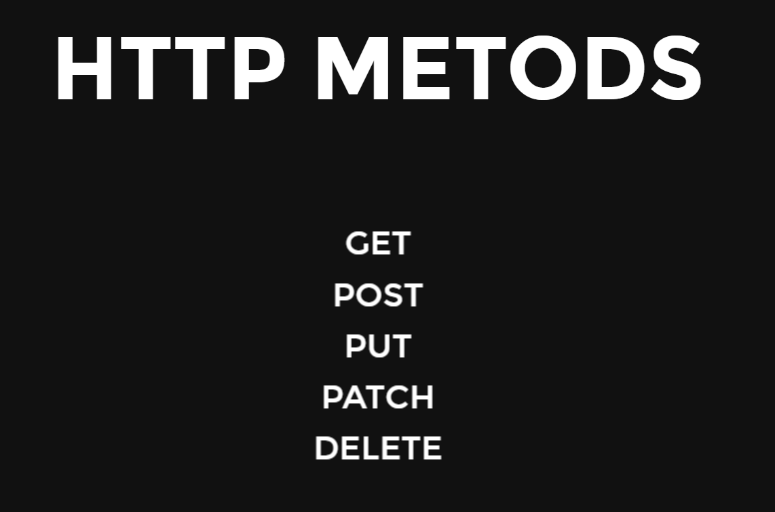
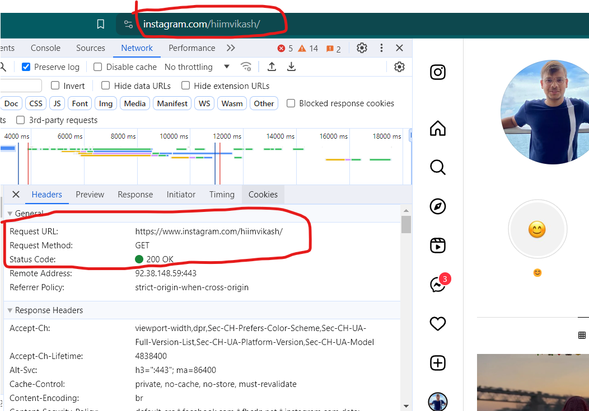
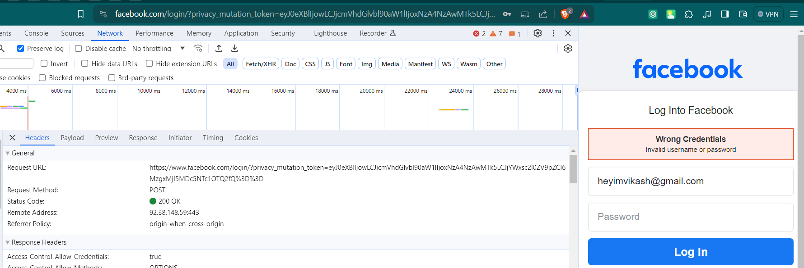

# 1.  What is Node js 
- Can we execute JS outside browser ? ... NO
- bcz browser has JS engine (chrome has V8 engine) to execute JS code.
- So to excecute JS outside browser, Ryan Dahl joined ```C++ & V8``` which was called **Node JS**
- Now Node js can do machine level tasks like File Handling, storage, OS
- we can create web servers using Node js.
- Node js is mostly used for API.
- **Node JS is runtime enviroment for JS, used in server-side**
- When we install node js ```npm``` is also installed

# 2. Package.json File
- we do ```npm init``` to initialize my project with ```package.json``` file
- a ```package.json``` file is a special file used in Node.js projects. 
- It holds important information about the project, such as its name, version, dependencies (other packages it relies on), 
- scripts to run, and other metadata. 
- This file helps manage the project and its dependencies effectively.
- if you losse the ```package.json``` file then it's matter of concern, let's say u gave ur project to your friend then ```npm i``` will install all ur dependencies to run that particular project.

# 3. Modules in JS
### ```Math.js```
```js
function add(a,b) => a+b;
function sub(a,b) => a-b;

// we can send anything in module.exports=
// whatever we send in module.exports= it get overwrite by the latest...so to send more than one fun or variable we send them in object.


module.exports = {add, sub};
// or
module.exports = {addfn : add, subfn : sub}
```
### ```index.js```
```js
const math = require('./Math.js') // ---> math.add(2,6)
// or
const {add, sub} = require('./Math.js') // ---> add(4,8)
// or
const {addfn, subfn} = require('./Math.js') // ---> subfn(8,2)


math.add(2,5);
add(2,3);
sub(5,7);
```
```allinOne```
```js
module.exports = "vikash";
const math = require('./Math.js') // ---> math = "vikash" (according to 1st exports)

module.exports = {add, sub};
const math = require('./Math.js') // ---> math.add(3,2)
const {add, sub} = require('./Math.js') // ---> sub(8,3)

module.exports = {addfn : add, subfn : sub}
const math = require('./Math.js') // ---> math.addfn(3,2)
const {addfn, subfn} = require('./Math.js') // ---> subfn(8,3)
```
# 4. File Handling in Node JS
- ```const fs = require('fs')```
- ```fs.writeFileSync("./test.txt", "Hi vikash")``` (if same filename then overwrite)
- ```fs.writeFile("./test.txt", "Hi vikash", ()=>{})``` (if same filename then overwrite)
- ```const result = fs.readFileSync("./contact.txt", "utf-8")```
- ```
    fs.readFile()("./contact.txt", "utf-8", (err, res)=>{
        if(err) console.log("Error : ", err);
        else console.log(res);
    })
    ```
- ```fs.appendFileSync("./test.txt", `Hey There \n`);```
- ```fs.appendFile('./log.txt', log, ()=>{// IF appended then what})```
- ```fs.cpSync("./test.txt", "./copy.txt");```
- ```fs.unlinkSync("./copy.txt")```  delete file
- ```fs.mkdirSync("my-docs/a/b", {reccursive : true})```

# 5. HTTP Server & Handling URL & HTTP methods
### ```url.js```
```js
// https://heyimvikash.com/search?project=1&code=1
// here after "?" is queryParameter containing key-value pair

const http = require('http');
const fs = require('fs');
const url = require('url');

const myServer = http.createServer((req, res)=>{
    const log = `${Date.now()}: ${req.url} New Req Received\n`; // req.url will contain everything after localhost:
    const myUrl = url.parse(req.url);
    console.log(myUrl)
    fs.appendFile('./log.txt', log, ()=>{
        
        switch(req.url){
            case '/' : res.end("Home");
            break;
            case "/about" : res.end("About")
            break;
            case "/contact" : res.end("Contact US")
            break;
            default : res.end("404 NOT FOUND");
        }
    });
    
});

myServer.listen(3000, ()=>{
    console.log("Server Started")
})
```
```output```
```js
Url {
  protocol: null,
  slashes: null,
  auth: null,
  host: null,
  port: null,
  hostname: null,
  hash: null,
  search: '?id=1&code=2',
  query: 'id=1&code=2',
  pathname: '/about/project',
  path: '/about/project?id=1&code=2',
  href: '/about/project?id=1&code=2'
}
```
This will parse the ```query:```
```js
const myUrl = url.parse(req.url, true);
console.log(myUrl);
```
```output```
```js
Url {
  protocol: null,
  slashes: null,
  auth: null,
  host: null,
  port: null,
  hostname: null,
  hash: null,
  search: '?id=1&code=2',
  query: [Object: null prototype] { id: '1', code: '2' },
  pathname: '/about/project',
  path: '/about/project?id=1&code=2',
  href: '/about/project?id=1&code=2'
}
```


### So this
```js
// https://heyimvikash.com/search?project=1&code=1
// here after "?" is queryParameter containing key-value pair

// Entered URL : localhost:3000/about?myname="vikash"&usn="20btrci021"
const http = require('http');
const fs = require('fs');
const url = require('url');

const myServer = http.createServer((req, res)=>{
    const log = `${Date.now()}: ${req.url} New Req Received\n`;
    const myUrl = url.parse(req.url, true);
    console.log(myUrl.query)
    fs.appendFile('./log.txt', log, ()=>{
        
        switch(myUrl.pathname){
            case '/' : res.end("Home");
            break;
            case "/about" : 
                res.end(`Hi ${myUrl.query.myname} your USN is ${myUrl.query.usn}`);
            break;
            case "/contact" : res.end("Contact US")
            break;
            default : res.end("404 NOT FOUND");
        }
    });
    
});

myServer.listen(3000, ()=>{
    console.log("Server Started")
})
```



### GET : When you want to GET some data from the server.

### POST : used to submit data to be processed to a specified resource, often causing a change in state or side effects on the server. POST requests are commonly used for form submissions, file uploads, and other actions where data is sent to the server for processing (such as validating the input, creating a new user account in the database, and performing any necessary business logic.)

### PUT : use for updating existing value.

```js
// https://heyimvikash.com/search?project=1&code=1
// here after "?" is queryParameter containing key-value pair

const http = require('http');
const fs = require('fs');
const url = require('url');

const myServer = http.createServer((req, res)=>{
    const log = `${Date.now()}: ${req.method} ${req.url} New Req Received\n`;
    const myUrl = url.parse(req.url, true);
    console.log(myUrl.query)
    fs.appendFile('./log.txt', log, ()=>{
        
        switch(myUrl.pathname){
            case '/' : 
            if(req.method === 'GET')
                res.end("Home");
            break;

            case "/about" : 
                res.end(`Hi ${myUrl.query.myname}`);
            break;

            case "/contact" : res.end("Contact US")
            break;
            
            case "/signup" :
                if(req.method === "GET") res.end("This signup form")
                else if(req.method === "GET") // db query and validation process
                    res.end("Suceess")

            default : res.end("404 NOT FOUND");
        }
    });
    
});

myServer.listen(3000, ()=>{
    console.log("Server Started")
})
```